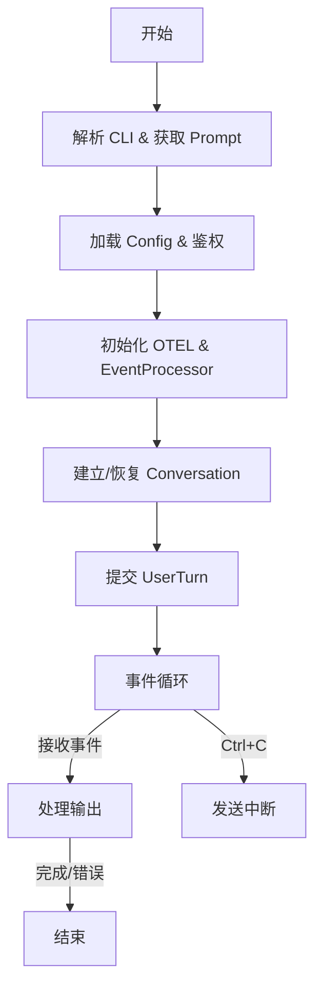

# `codex_exec::run_main` 方法文档

## 1. 简介
`run_main` 是 `codex-exec` crate 的主要入口点（非交互式模式）。它负责协调整个执行流程，包括参数解析、环境配置、会话管理以及与 Codex Core 的事件驱动交互。该方法旨在处理一次性的用户指令或恢复之前的会话。

## 2. 流程概览

该方法的执行流程可以大致划分为以下几个阶段：

1.  **输入与环境准备**：处理 CLI 参数、读取 Prompt、设置日志和输出格式。
2.  **配置加载与鉴权**：加载配置文件、应用覆盖项、检查登录状态。
3.  **组件初始化**：初始化 OpenTelemetry、EventProcessor（输出处理器）和 OSS 提供商。
4.  **会话建立**：创建或恢复 Conversation。
5.  **执行循环**：提交任务并进入事件循环，直到任务完成或被中断。

## 3. 核心流程详解

### 3.1 输入处理与 Prompt 获取
- **Prompt 来源**：优先使用 CLI 参数中的 Prompt。如果未提供，且未强制指定从 stdin 读取（`-`），代码会检查 stdin 是否为终端（TTY）。如果是终端且无 Prompt，则报错退出；否则尝试从 stdin 读取。
- **输出 Schema**：如果指定了 `output_schema`，会预先加载并验证 JSON Schema。
- **颜色支持**：根据 `--color` 参数或自动检测（`supports_color`）来决定 stdout/stderr 是否启用 ANSI 颜色。

### 3.2 配置加载 (Configuration)
- **Sandbox 模式**：根据 `full_auto`（全自动写权限）、`dangerously_bypass_approvals_and_sandbox`（危险全权限）或 `--sandbox-mode` 参数确定沙盒策略。
- **Config 加载**：
    1. 找到 `codex_home`。
    2. 加载 `config.toml` 并应用 CLI 传入的键值对覆盖 (`-c`)。
    3. 构建 `ConfigOverrides` 对象，将 CLI 的特定参数（如 model, cwd, approval_policy 等）覆盖到最终配置中。
- **OSS (Open Source Software) 模型**：如果启用了 `--oss`，会解析并验证本地模型提供商（如 LMStudio 或 Ollama），并确保其就绪。

### 3.3 初始化与鉴权
- **鉴权**：调用 `enforce_login_restrictions` 确保用户满足登录要求。
- **OpenTelemetry (OTEL)**：初始化分布式追踪，将其作为 tracing layer 添加到全局订阅者中。
- **EventProcessor**：根据 `--json` 参数决定实例化 `EventProcessorWithJsonOutput`（机器可读）还是 `EventProcessorWithHumanOutput`（人类可读）。
- **Git 检查**：默认检查当前目录是否在 Git 仓库中，以确保操作的安全性（可通过 `--skip-git-repo-check` 跳过）。

### 3.4 会话管理 (Conversation Manager)
- **AuthManager & ConversationManager**：初始化核心管理器。
- **Resume 逻辑**：
    - 如果命令是 `Resume`，则通过 `resolve_resume_path` 查找目标会话路径（支持通过 ID 或 `--last` 查找）。
    - 调用 `resume_conversation_from_rollout` 恢复会话，或 `new_conversation` 创建新会话。
- **配置摘要**：在正式执行前，通过 `event_processor` 打印当前的有效配置摘要。

### 3.5 事件循环 (Event Loop)
这是方法的核心部分，负责驱动异步交互：
1.  **提交任务**：将图片和文本 Prompt 封装为 `UserInput`，通过 `conversation.submit(Op::UserTurn)` 发送给 Core。
2.  **后台监听任务**：
    - 启动一个 `tokio::spawn` 任务，同时监听 `conversation.next_event()` 和 `Ctrl+C` 信号。
    - 如果收到 `Ctrl+C`，发送 `Op::Interrupt` 给 Core，并退出监听循环。
    - 正常事件通过 `mpsc::unbounded_channel` 发送回主线程。
3.  **主线程处理**：
    - 从 Channel 接收事件。
    - 检查是否包含错误（`EventMsg::Error`），用于最终设置退出码。
    - 调用 `event_processor.process_event(event)` 处理事件展示。
    - 根据返回的 `CodexStatus` 决定是否继续、发起关闭（`Op::Shutdown`）或直接退出循环。

## 4. 潜在问题分析

1.  **Stdin 读取阻塞**：
    - 虽然代码检查了 `is_terminal()`，但在非交互式脚本或管道中，如果上游没有写入数据且未关闭管道，`read_to_string` 可能会无限期阻塞。

2.  ~~**错误处理与退出码**：~~
    - 方法通过 `error_seen` 变量跟踪是否发生过错误。如果 Core 发送了 `EventMsg::Error`，即使后续流程正常结束，进程最终也会以非零状态码退出。这对于 CI/CD 集成很重要。

3.  **并发与中断**：
    - **快速退出机制**：当用户按下 `Ctrl+C` 时，CLI 会捕获信号，向 Core 发送 `Op::Interrupt`，然后立即退出事件监听循环（导致 `tx` drop，进而结束主线程的 `rx` 循环）。
    - **事件丢失**：由于 CLI 在发送中断后立即停止监听，Core 随后产生的 `TurnInterrupted` 或其他收尾事件将不会被 CLI 处理或显示。CLI 优先保证对用户退出操作的响应速度，而不是等待 Core 的优雅停机。

4.  **配置优先级**：
    - 配置覆盖层级较多（默认 -> 配置文件 -> CLI `-c` -> CLI 具体参数）。虽然灵活，但也增加了排查配置生效来源的复杂度。`print_config_summary` 在此处起到了关键的调试作用。
